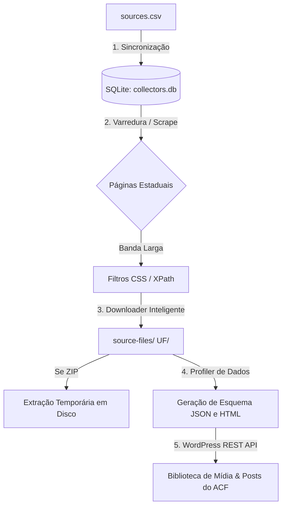

# 📊 Pipeline de ETL - ObservaDados

Este é o pipeline automatizado de **Extração, Transformação e Carga (ETL)** do projeto **ObservaDados**. Desenvolvido em Python, ele é responsável por varrer portais oficiais de segurança pública e defesa social de diversos estados brasileiros, baixar bases de dados brutas (CSV, XLSX, ZIP), extrair metadados estruturais (profiling) de forma automatizada e publicar tudo de maneira sincronizada e otimizada em um portal WordPress usando a API REST e Advanced Custom Fields (ACF).

---

## 🏗️ Arquitetura do Pipeline

O pipeline opera sob um modelo de **orquestração centralizada** e **execução em 4 fases**:



1. **Sincronização (`sources.csv` ➔ SQLite)**: A planilha de configurações `sources.csv` atua como a fonte da verdade estrutural. O script sincroniza essas definições para um banco leve SQLite local (`collectors.db`), evitando chamadas repetidas e organizando o histórico.
2. **Varredura (Scrape & Discovery)**: O pipeline acessa as URLs configuradas. Se for uma página dinâmica, utiliza seletores CSS personalizados para identificar os links exatos de download de arquivos mais recentes do mês.
3. **Extração Inteligente (Download & Cache)**:
   - Baixa os arquivos diretamente para pastas organizadas por Unidade Federativa (UF), ex: `source-files/RS/`.
   - **Mecanismo de Cache**: Se o arquivo com a assinatura cronológica correspondente já existir localmente e a flag de sobrescrita não for informada, o download é ignorado.
   - **Bypass de Firewalls**: O robô emula User-Agents legítimos de navegadores para evitar bloqueios e cancelamentos de conexão (erro 10054) comuns em firewalls de órgãos públicos.
4. **Data Profiling Híbrido (Transform)**:
   - Lê o arquivo localmente. No caso de arquivos grandes compactados em `.zip` (ex: Rio Grande do Sul), o robô extrai temporariamente o arquivo interno para a pasta temporária do sistema operacional, faz a análise estrutural e exclui os arquivos temporários em seguida.
   - Analisa quantidade de linhas, colunas, tipos de dados de cada coluna e amostras de registros.
   - Converte essa análise estrutural em um payload de metadados em **JSON** e em uma tabela de visualização estilizada em **HTML**.
5. **Carga Otimizada (Load no WordPress)**:
   - **Modo Novo Arquivo**: Faz o upload do arquivo binário (ou ZIP original leve) para a biblioteca de mídia do WordPress. Associa-o ao Post do Dataset correspondente e anexa os payloads de metadados JSON e HTML aos campos personalizados do ACF.
   - **Modo Delta/Recorrente (Sem Novo Arquivo)**: Se o arquivo já existe no servidor local e o dataset já está criado no WordPress, o robô faz uma chamada ultrarrápida (partial update) atualizando **apenas** o campo `data_ultima_varredura` no WP via API REST. Isso economiza megabytes de uploads duplicados e tempo de processamento.

---

## 📂 Estrutura de Diretórios do Projeto

```text
observadados-etl/
├── .env                  # Variáveis de ambiente locais (WP_URL, WP_USER, etc.) [Ignorado no Git]
├── .env.example          # Modelo de configuração de credenciais públicas
├── .gitignore            # Regras de exclusão do Git (ignora bases locais, logs e .db)
├── collectors.db         # Banco de dados SQLite local de histórico e controle [Ignorado no Git]
├── main.py               # Orquestrador principal do pipeline ETL
├── core/                 # Módulos centrais reutilizáveis do sistema
│   ├── base_scraper.py   # Web scraper base genérico com emulação de cabeçalhos Chrome
│   ├── db_manager.py     # Controle de banco SQLite e sincronização de fontes CSV
│   ├── downloader.py     # Downloader resiliente por blocos e descompactador ZIP
│   ├── mailer.py         # Módulo para envio de e-mails administrativos de relatório
│   ├── profiler.py       # Gerador de metadados JSON/HTML usando Pandas e openpyxl
│   └── wp_client.py      # Integração completa com o WordPress (REST API & ACF)
├── scrapers/             # Scrapers específicos por portais de estados
│   ├── __init__.py       # Registro e fábrica de scrapers customizados
│   └── scraper_rj.py     # Scraper específico com regras avançadas para o Rio de Janeiro
├── static-sources/       # Configuração estática do robô
│   └── sources.csv       # Lista estruturada de fontes de dados e seletores
└── source-files/         # Repositório de arquivos brutos baixados [Ignorado no Git]
    ├── RJ/               # Arquivos locais organizados por UF
    └── RS/
```

---

## 🛠️ Configuração e Instalação

### 1. Pré-requisitos
* Python 3.10 ou superior instalado no sistema.

### 2. Clonar e Configurar Ambiente
Crie um ambiente virtual na pasta do projeto e instale as dependências requeridas:

```bash
# Criar ambiente virtual
python -m venv .venv

# Ativar ambiente virtual (Windows)
.venv\Scripts\activate

# Ativar ambiente virtual (Linux/macOS)
source .venv/bin/activate

# Instalar dependências necessárias
pip install pandas openpyxl requests beautifulsoup4
```

### 3. Configurar Variáveis de Ambiente (`.env`)
Copie o modelo de variáveis de ambiente para a raiz do projeto:

```bash
cp .env.example .env
```

Edite o arquivo `.env` recém-criado com as credenciais do seu WordPress local ou de produção:

```ini
WP_URL=https://observadados.org
WP_USER=admin_coletor
WP_APP_PASSWORD=xxxx xxxx xxxx xxxx xxxx
```
> [!IMPORTANT]
> A senha do WordPress (`WP_APP_PASSWORD`) deve ser uma **Senha de Aplicativo (Application Password)** gerada diretamente nas configurações do perfil do usuário no Painel do WordPress, e não a senha comum de login.

---

## 🚀 Como Executar o Pipeline

O orquestrador `main.py` aceita várias flags de comando para controle detalhado da execução:

### 1. Execução Padrão (Local)
Baixa as fontes ativas definidas no `sources.csv` que estão com a frequência de coleta expirada e armazena os arquivos localmente na pasta `source-files/`:

```bash
python main.py
```

### 2. Sincronizar e Publicar no WordPress
Baixa as novas fontes e publica arquivos e metadados estruturais na biblioteca de mídia e nos posts de tipo de conteúdo `dataset` no WordPress:

```bash
python main.py --publish-wordpress
```

### 3. Forçar Sobrescrita e Download
Ignora a frequência de verificação local e o cache do disco, forçando o robô a realizar novamente o download de todos os arquivos de todas as fontes:

```bash
python main.py --overwrite --publish-wordpress
```

### 4. Limpar Arquivos Temporários e Locais
Exclui todos os diretórios e arquivos armazenados localmente em `source-files/` antes de rodar o novo ciclo de downloads:

```bash
python main.py --clean
```

### 5. Reinicializar Banco de Dados
Apaga completamente o banco SQLite local (`collectors.db`), limpando as tabelas e o histórico de downloads:

```bash
python main.py --reset-db
```

---

## ⚙️ Configurando Novas Fontes (`static-sources/sources.csv`)

O arquivo [sources.csv](file:///C:/var/www/observadados-etl/static-sources/sources.csv) controla quais sites o robô deve monitorar. Ele utiliza delimitador de ponto e vírgula (`;`) e a codificação `Windows-1252` para compatibilidade com acentos nativos em editores como Microsoft Excel.

### Principais Colunas do CSV:
* `collector_key`: Chave identificadora única do dataset (ex: `rs_seguranca`, `rj_feminicidio`).
* `uf`: Unidade federativa (ex: `RS`, `RJ`, `CE`).
* `url`: URL da página que contém os links de download ou a URL direta do arquivo.
* `is_active`: Define se a fonte será processada (`1` para ativo, `0` para ignorar).
* `acf_frequencia`: Frequência que dita o ciclo do robô (valores válidos: `diaria`, `semanal`, `mensal`, `anual`).
* `css_selector`: Seletor CSS usado pelo scraper dinâmico para encontrar os links de download na página (ex: `a[href$='.csv']` ou `a[href$='.zip']:not([href*='semestre'])`).
* `acf_origem`: Nome oficial do órgão que fornece os dados (ex: `Secretaria da Segurança Pública do Rio Grande do Sul`). Caso exista uma instituição cadastrada no WordPress sob esse nome (`post_type = instituicao`), o script criará automaticamente o relacionamento de posts!

---

## 🔒 Segurança e Versionamento (Git)

Como o pipeline lida com credenciais confidenciais de servidores do WordPress e consome grande volume de dados binários, o arquivo [`.gitignore`](file:///C:/var/www/observadados-etl/.gitignore) da pasta do projeto está configurado para garantir a segurança absoluta das suas chaves de acesso:

- **`.env` e `.env.*`**: **NUNCA** são enviados ao repositório no GitHub para proteger as senhas de produção do WordPress.
- **`collectors.db`**: Ignorado para evitar conflitos de mesclagem binários locais e histórico de execução específico de desenvolvedores.
- **`source-files/`**: Todos os gigabytes de dados brutos coletados ficam guardados apenas em cache local nas máquinas de execução para economizar armazenamento no repositório de código.
