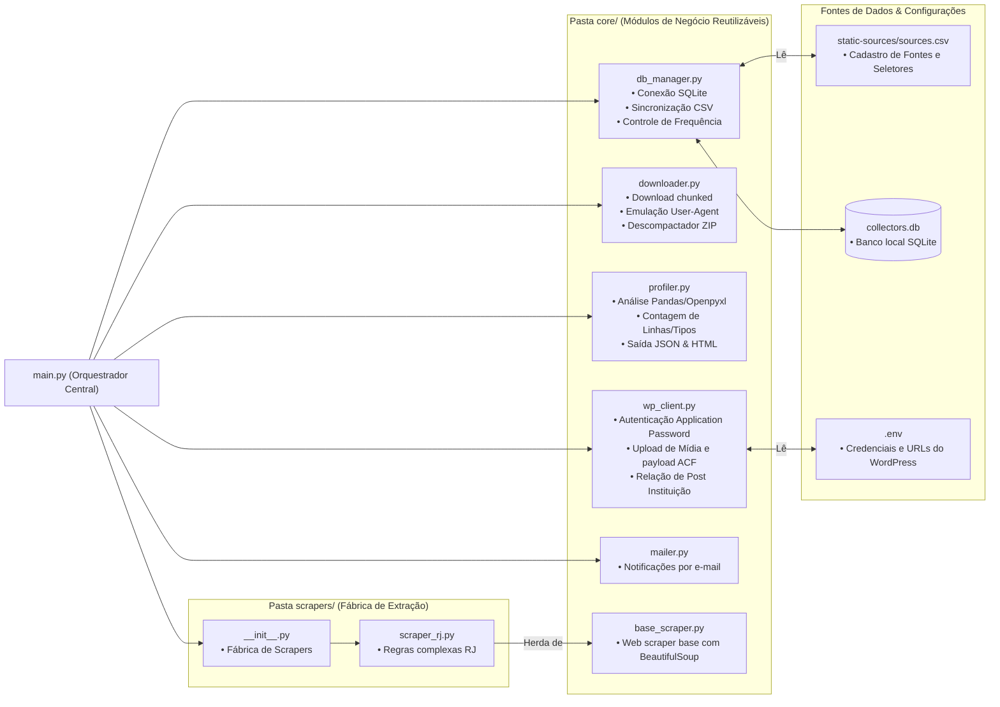

```mermaid
graph LR
    %% Nós de Entrada
    Main["main.py (Orquestrador Central)"]

    %% Pasta Core
    subgraph Core ["Pasta core/ (Módulos de Negócio Reutilizáveis)"]
        DBM["db_manager.py<br/>• Conexão SQLite<br/>• Sincronização CSV<br/>• Controle de Frequência"]
        DWN["downloader.py<br/>• Download chunked<br/>• Emulação User-Agent<br/>• Descompactador ZIP"]
        PRO["profiler.py<br/>• Análise Pandas/Openpyxl<br/>• Contagem de Linhas/Tipos<br/>• Saída JSON & HTML"]
        WPC["wp_client.py<br/>• Autenticação Application Password<br/>• Upload de Mídia e payload ACF<br/>• Relação de Post Instituição"]
        MLR["mailer.py<br/>• Notificações por e-mail"]
        SCR_B["base_scraper.py<br/>• Web scraper base com BeautifulSoup"]
    end

    %% Pasta Scrapers
    subgraph Scrapers ["Pasta scrapers/ (Fábrica de Extração)"]
        INIT_S["__init__.py<br/>• Fábrica de Scrapers"]
        SCR_RJ["scraper_rj.py<br/>• Regras complexas RJ"]
    end

    %% Fontes Estáticas e Banco
    subgraph Fontes ["Fontes de Dados & Configurações"]
        CSV["static-sources/sources.csv<br/>• Cadastro de Fontes e Seletores"]
        DB[("collectors.db<br/>• Banco local SQLite")]
        ENV[".env<br/>• Credenciais e URLs do WordPress"]
    end

    %% Relações de Importação e Fluxo
    Main --> DBM
    Main --> DWN
    Main --> PRO
    Main --> WPC
    Main --> INIT_S
    Main --> MLR
    
    INIT_S --> SCR_RJ
    SCR_RJ -- Herda de --> SCR_B
    
    DBM <--> DB
    DBM <-- Lê --> CSV
    WPC <-- Lê --> ENV

```