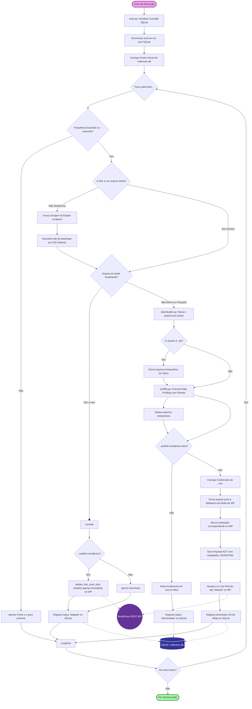

```mermaid
graph TD
    %% Estilo e Definições
    style Start fill:#f9f,stroke:#333,stroke-width:2px
    style End fill:#9f9,stroke:#333,stroke-width:2px
    style WP fill:#639,stroke:#fff,stroke-width:2px,color:#fff
    style DB fill:#339,stroke:#fff,stroke-width:2px,color:#fff

    Start([Início da Execução]) --> Init[main.py: Inicializa Conexão SQLite]
    Init --> SyncDB[Sincroniza sources.csv com SQLite]
    SyncDB --> LoadActive[Carrega Fontes Ativas de collectors.db]
    
    %% Loop de Fontes
    LoadActive --> LoopStart{Para cada fonte...}
    
    LoopStart --> CheckFreq{Frequência Expirada ou --overwrite?}
    
    CheckFreq -- Não --> SkipSource[Ignorar Fonte e ir para próxima]
    SkipSource --> LoopEnd
    
    CheckFreq -- Sim --> CheckType{A URL é um arquivo direto?}
    
    %% Extract
    CheckType -- Não (Dinâmica) --> RunScraper[Invoca Scraper do Estado scrapers/]
    RunScraper --> Discover[Descobre link de download via CSS Selector]
    Discover --> CheckCache
    
    CheckType -- Sim (Direto) --> CheckCache{Arquivo já existe localmente?}
    
    %% Cache e Download
    CheckCache -- Sim e sem --overwrite --> WPEvents{--publish-wordpress?}
    WPEvents -- Sim --> WPDelta[update_last_scan_only: Atualiza apenas timestamp no WP]
    WPEvents -- Não --> SkipDownload[Ignora Download]
    WPDelta --> RecordSkipped[Registra status 'skipped' no SQLite]
    SkipDownload --> RecordSkipped
    RecordSkipped --> LoopEnd
    
    CheckCache -- Não (Novo ou Forçado) --> Download[downloader.py: Baixa o arquivo por partes]
    Download --> CheckZip{O arquivo é .zip?}
    
    %% Transform
    CheckZip -- Sim --> ZipExtract[Extrai arquivos temporários em disco]
    ZipExtract --> Profiling[profiler.py: Executa Data Profiling com Pandas]
    Profiling --> DelTemp[Deleta arquivos temporários]
    DelTemp --> LoadCheck
    
    CheckZip -- Não --> Profiling
    
    %% Load
    Profiling --> LoadCheck{--publish-wordpress ativo?}
    
    LoadCheck -- Não --> LocalSave[Salva localmente em source-files/]
    LocalSave --> RecordSuccess[Registra status 'downloaded' no SQLite]
    
    LoadCheck -- Sim --> WPAuth[Carrega Credenciais do .env]
    WPAuth --> WPUpload[Envia arquivo para a Biblioteca de Mídia do WP]
    WPUpload --> WPSearchInst[Busca Instituição correspondente no WP]
    WPSearchInst --> WPPayload[Gera Payload ACF com metadados JSON/HTML]
    WPPayload --> WPPublish[Atualiza ou Cria Post de tipo 'dataset' no WP]
    WPPublish --> RecordWPSuccess[Registra download e ID de Mídia no SQLite]
    RecordWPSuccess --> LoopEnd
    
    LoopEnd --> LoopMore{Há mais fontes?}
    LoopMore -- Sim --> LoopStart
    LoopMore -- Não --> End([Fim da Execução])

    %% Relações com Bancos Externos
    RecordSkipped -.-> DB[(SQLite: collectors.db)]
    RecordSuccess -.-> DB
    RecordWPSuccess -.-> DB
    WPPublish -.-> WP((WordPress REST API))
    WPDelta -.-> WP
```