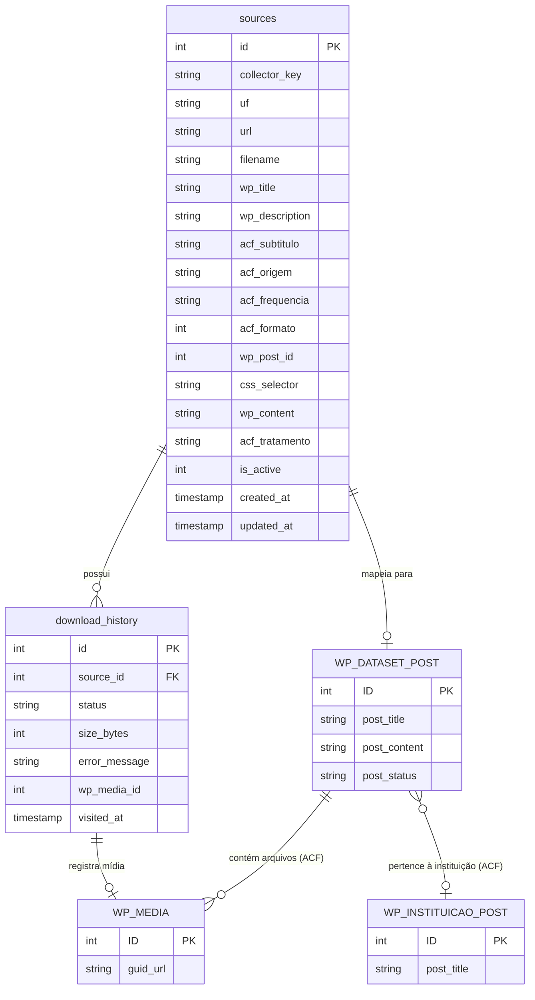

```mermaid
erDiagram
    %% SQLite Local
    sources {
        int id PK
        string collector_key
        string uf
        string url
        string filename
        string wp_title
        string wp_description
        string acf_subtitulo
        string acf_origem
        string acf_frequencia
        int acf_formato
        int wp_post_id
        string css_selector
        string wp_content
        string acf_tratamento
        int is_active
        timestamp created_at
        timestamp updated_at
    }

    download_history {
        int id PK
        int source_id FK
        string status
        int size_bytes
        string error_message
        int wp_media_id
        timestamp visited_at
    }

    sources ||--o{ download_history : "possui"

    %% WordPress Estrutura
    WP_DATASET_POST {
        int ID PK
        string post_title
        string post_content
        string post_status
    }

    WP_INSTITUICAO_POST {
        int ID PK
        string post_title
    }

    WP_MEDIA {
        int ID PK
        string guid_url
    }

    %% Relações Lógicas com o WordPress
    sources ||--o| WP_DATASET_POST : "mapeia para"
    download_history ||--o| WP_MEDIA : "registra mídia"
    
    %% Relacionamentos do Payload do ACF do Dataset
    WP_DATASET_POST ||--o{ WP_MEDIA : "contém arquivos (ACF)"
    WP_DATASET_POST }o--o| WP_INSTITUICAO_POST : "pertence à instituição (ACF)"

```